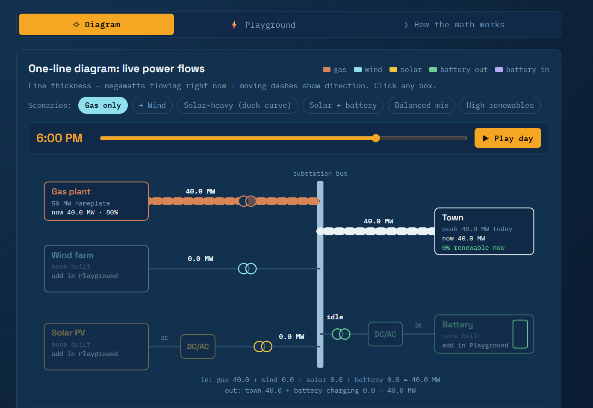

# Distributed Energy Playground

The Distributed Energy Playground is an interactive, browser-based teaching tool that shows how wind turbines, solar PV, and battery storage work alongside a conventional gas plant to serve a small town's daily electricity demand. It's built for curious non-engineers who know the basic concepts and want to understand how these resources interact, from why solar gets curtailed at noon to how a battery's power rating (MW) differs from its energy capacity (MWh).  

The app has three linked views that share one simulation and one time slider. The **Diagram** tab is an animated one-line grid diagram where line thickness and direction show power flow in real time, and clicking any component explains what it's doing and why. The **Playground** tab lets you add 3 MW turbines, 1 MW solar blocks, and batteries, switch seasons, weather, and battery strategy, and see the results in stacked 24-hour charts, a battery state-of-charge chart, and headline numbers like renewable share, curtailment, and gas ramping. The **How the math works** tab shows every formula with live values, including the wind power curve and solar inverter clipping. Under the hood, the model simulates a 15-minute dispatch across the day, respects the gas plant's minimum output, plans battery charging with a bisection search, and tracks how much stored energy came from renewables so the green share is counted honestly.

The project is a single self-contained HTML file written in vanilla JavaScript with inline SVG charts, so it has no build step or dependencies. Just open `index.html` in any modern browser. It's intentionally a learning tool rather than an engineering model: weather is deterministic, the battery has perfect foresight of the day, and the grid is treated as a lossless bus. Possible next steps include a side-by-side scenario comparison, cost and CO₂ estimates, and a multi-day view that reflects annual capacity factors.

